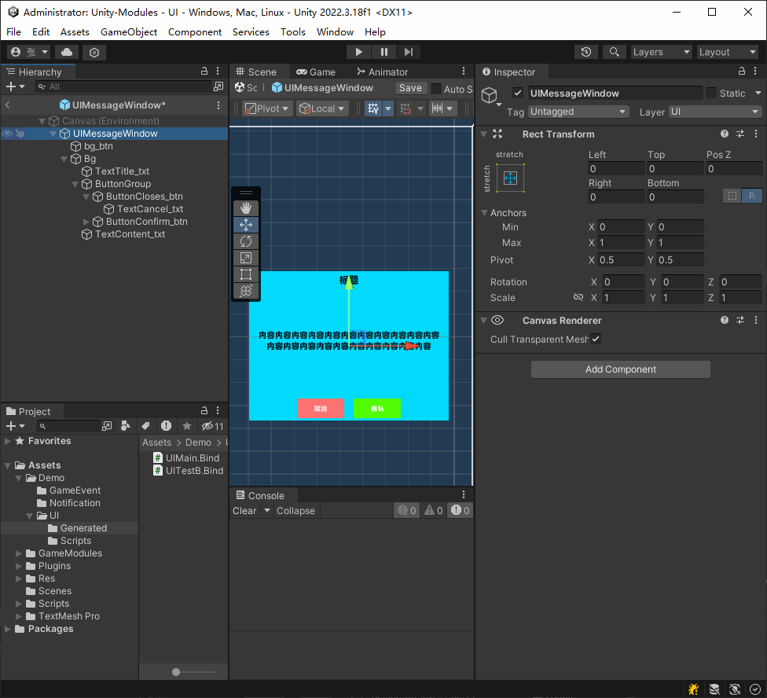

# 一些开箱即用的Unity模块
- 部分模块依赖 DoTween、[UniTask](https://github.com/Cysharp/UniTask)

## UI模块
一个功能完整的ui框架，实现了界面开关、覆盖与被覆盖、分层、栈管理、绑定代码自动生成并绑定等

<br>
<sub>自动生成并绑定演示</sub>

## 事件模块

一个简洁、0GC分配、类型安全的事件系统

```c#
    // 注册
    GameEventID.Test.AddListener(TestFunc);						// 无参
    GameEventID.Test.AddListener<string>(TestFunc);		 // 有参
    // 移除
    GameEventID.Test.RemoveListener(TestFunc);
    GameEventID.Test.RemoveListener<string>(TestFunc);
    // 广播
    GameEventID.Test.Dispatch();
	GameEventID.Test.Dispatch("TestStr");
```

## 红点模块

**针对大量红点项目进行了优化的红点系统**

- 限制了红点模块单帧执行时间，避免大量数据变动时因红点造成的游戏卡顿
- 从设计上避免了同一红点逻辑单帧多次执行
- 简洁易用，注册后只需在数据变动时标记所需刷新的红点即可


##  池模块

分为 **私有池** 和 **公共池**，可根据不同情况使用

#### 私有池

适用于独立模块或临时用途，需要手动持有和管理生命周期。

```c#
private  ObjectPool<Item> _pool = newObjectPool<Item>(maxNum);

_pool.Get(); //获取对象
_pool.Release(item);//回收对象

//释放整个池
_pool.Dispose();
```

#### 公共池

适用于全局复用的类型，静态访问，无需持有引用。

```c#
PublicPool<Item>.Get(); //获取对象
PublicPool<Item>.Release(item);//回收对象

//释放整个池
PublicPool<Item>.Dispose();
```

 若对象实现了 `IObject` 接口，回收时会自动调用 `OnRelease()`，用于状态清理。

##### 针对频繁使用的集合类型，提供方便的静态对象池

```csharp
// 获取 List（自动初始化）
var list = ListPool<int>.Get();
// 回收（自动清空数据）
ListPool<int>.Release(list);

// 获取 Dictionary（自动初始化）
var dict = DictionaryPool<string, float>.Get();
// 回收（自动清空数据）
DictionaryPool<string, float>.Release(dict);
```


## 计时器模块

支持单次计时、循环计时、配置是否受TimeScal影响、传递参数


## 状态机模块

一个状态机模块
